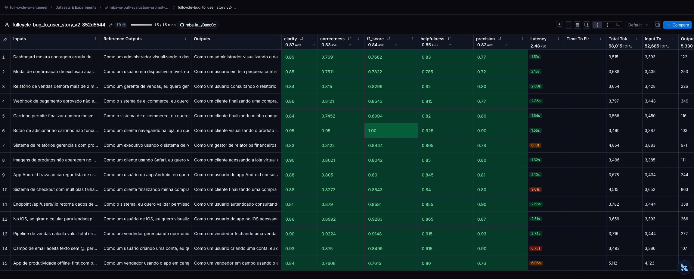
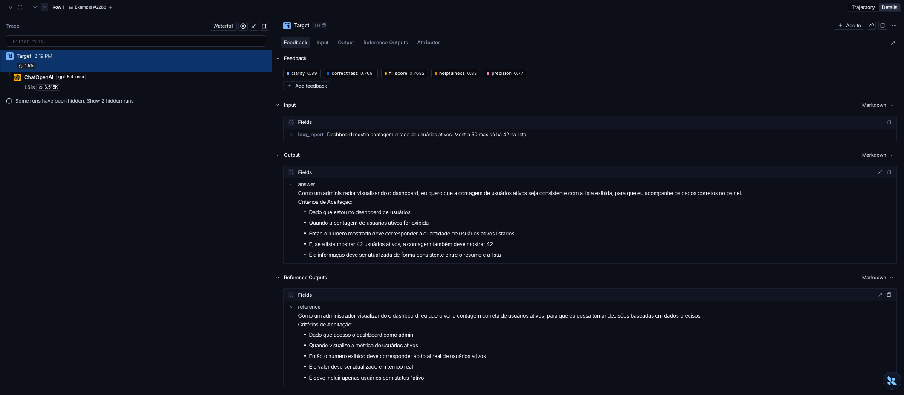
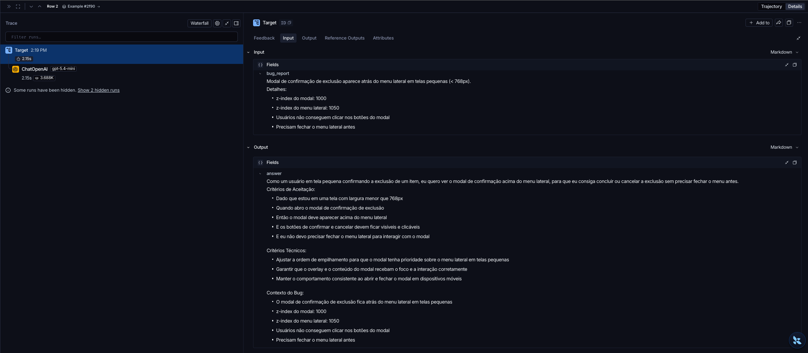
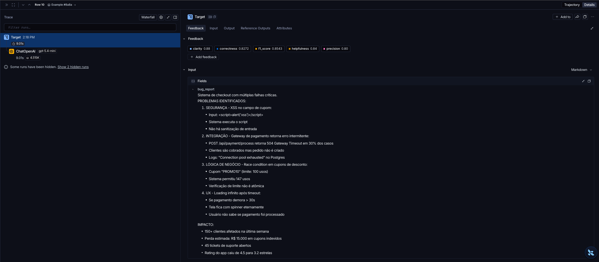

# Pull, Otimização e Avaliação de Prompts com LangChain e LangSmith

Projeto que transforma relatos de bugs em User Stories usando um prompt otimizado e versionado no LangSmith Prompt Hub. O fluxo completo é:

1. **Pull** do prompt de baixa qualidade `leonanluppi/bug_to_user_story_v1` para `prompts/bug_to_user_story_v1.yml`;
2. **Otimização** do prompt em `prompts/bug_to_user_story_v2.yml` com técnicas de Prompt Engineering;
3. **Push** público da versão otimizada para `fullcycle/bug_to_user_story_v2`, com descrição, tags e técnicas;
4. **Avaliação** no LangSmith com 5 métricas (Helpfulness, Correctness, F1-Score, Clarity e Precision), todas ≥ 0.8.

Resultado final: **aprovado**, com média **0.8403** e todas as métricas ≥ 0.8 (detalhes em [Resultados Finais](#resultados-finais)).

Este repositório é um fork do desafio [devfullcycle/mba-ia-pull-evaluation-prompt](https://github.com/devfullcycle/mba-ia-pull-evaluation-prompt), onde está o enunciado original.

### Documentação do projeto

| Documento | Conteúdo |
|---|---|
| [docs/SPEC.md](docs/SPEC.md) | Especificação global e catálogo das specs de cada entrega |
| [docs/ARCHITECTURE.md](docs/ARCHITECTURE.md) | Decisões de arquitetura (schema do YAML, mapeamento com o Hub, modelos) |
| [docs/evaluation-log.md](docs/evaluation-log.md) | Registro das 6 rodadas de avaliação, com diagnóstico de cada uma |

---

## Técnicas Aplicadas (Fase 2)

O prompt v2 combina três técnicas, listadas em `techniques_applied` no YAML e publicadas como tags no Hub.

### 1. Role Prompting

**Por quê:** converter um bug em User Story é uma tarefa de produto, não de suporte. Definir a persona de um Product Manager faz o modelo escrever do ponto de vista de quem sofre o problema e descrever o **comportamento correto esperado**, em vez de repetir o defeito.

**Como foi aplicada:** o system prompt começa com:

> Você é um Product Manager sênior, especialista em transformar relatos de bugs em User Stories claras, específicas e prontas para o time de desenvolvimento. Você escreve do ponto de vista de quem é afetado pelo problema e descreve o comportamento correto esperado, não o defeito.

Uma regra complementa a persona: ela deve ser específica e ter contexto, como "um usuário criando uma conta" ou "um administrador visualizando o dashboard". Quando não há um usuário direto (integrações, processamento interno, segurança), a persona é "o sistema".

### 2. Skeleton of Thought

**Por quê:** o dataset tem relatos de complexidade muito diferente: de uma frase até um relato com quatro problemas, logs e métricas de impacto. Uma única estrutura de resposta fica longa demais para os casos simples ou rasa demais para os complexos. O esqueleto define **antes** a estrutura da resposta e só depois o modelo preenche o conteúdo.

**Como foi aplicada:**

- **Planejamento interno:** antes de escrever, o modelo identifica, sem mostrar na resposta, quem é afetado, qual é o comportamento esperado e como medi-lo, quantos problemas distintos há e quais dados técnicos foram citados.
- **Escolha do formato:** uma regra explícita decide entre três esqueletos.

| Formato | Quando usar | Estrutura |
|---|---|---|
| 1 | Relato de uma ou duas frases, sem detalhes | User Story + Critérios de Aceitação (5 itens) |
| 2 | Um único problema com detalhes (passos, logs, valores, observações) | Formato 1 + uma seção de critérios extra (padrão: "Critérios Técnicos") + seção de contexto com os dados do relato |
| 3 | Dois ou mais problemas distintos listados no relato | User Story geral + `=== USER STORY PRINCIPAL ===`, critérios agrupados por problema (A, B, C…), critérios técnicos, contexto do bug e tasks sugeridas |

- **Checagem final:** se o relato não lista vários problemas, a resposta não pode conter `===`.

### 3. Few-shot Learning

**Por quê:** é obrigatória no desafio e é a forma mais direta de mostrar o tom, o nível de especificidade e o formato exato esperados. Regras sozinhas não bastaram: o modelo só passou a acertar o tamanho e o formato depois de ver exemplos de cada esqueleto.

**Como foi aplicada:** o system prompt traz **4 exemplos originais**, todos escritos para o projeto, sem copiar nenhum caso do dataset de avaliação. Um teste automatizado garante isso. Cada exemplo é delimitado por `<exemplo_N>` com `Entrada:` e `Saída:`.

| Exemplo | Relato | Formato |
|---|---|---|
| 1 | Botão "Salvar rascunho" do editor de blog não funciona | 1 |
| 2 | Filtro de período do extrato ignora o último dia | 1 |
| 3 | Exportação de fatura em PDF falha acima de 50 itens (passos, endpoint, log) | 2 |
| 4 | App de consultas com 3 problemas distintos (fuso horário, reserva duplicada, iOS) | 3 |

### Outras regras do prompt

- **Separação system/user:** o system prompt tem a persona, as regras, o esqueleto e os exemplos. O user prompt tem só o relato (`{bug_report}`, a única variável do template) e o pedido para decidir o formato antes de escrever.
- **Regras explícitas:** responder em português; devolver apenas a User Story; nunca contradizer o relato; usar números só em desempenho, limites ou cálculos derivados do relato; colocar sugestões técnicas só nos Formatos 2 e 3.
- **Critérios usuais por tipo de problema:** interface, permissão e segurança, desempenho, integração, cálculo e compatibilidade.
- **Edge cases tratados:** relato vago ou curto, vários problemas no mesmo relato, preservação de dados técnicos (IDs, valores, logs, endpoints) e entrada que não descreve um bug.

---

## Resultados Finais

### Evidências públicas no LangSmith

**Dataset de avaliação (público, com os experimentos):**
https://smith.langchain.com/public/f729e506-7cff-4e43-8ded-cebe2726018d/d

O link abre sem login e mostra:
- o dataset `mba-ia-pull-evaluation-prompt-eval` com os 15 exemplos;
- os 6 experimentos rodados contra ele, incluindo o aprovado `fullcycle-bug_to_user_story_v2-852d5544`, com o tracing de cada exemplo.

Prompt publicado: [`fullcycle/bug_to_user_story_v2`](https://smith.langchain.com/hub/fullcycle/bug_to_user_story_v2).

### Notas do prompt aprovado

```
==================================================
Prompt: fullcycle/bug_to_user_story_v2
==================================================

Métricas Derivadas:
  - Helpfulness: 0.85 ✓
  - Correctness: 0.83 ✓

Métricas Base:
  - F1-Score: 0.84 ✓
  - Clarity: 0.87 ✓
  - Precision: 0.82 ✓

📊 MÉDIA GERAL: 0.8403

✅ STATUS: APROVADO - Todas as métricas >= 0.8
```



### Tracing de exemplos







### Evolução das rodadas

Foram 6 rodadas de avaliação. A sexta foi autorizada além do limite de 5 definido na [spec da iteração](docs/specs/evaluation-iteration.md). O diagnóstico completo de cada rodada está em [docs/evaluation-log.md](docs/evaluation-log.md).

| Rodada | Gerador / juiz | Principal mudança | Helpf. | Correct. | F1 | Clarity | Precision | Média |
|---|---|---|---|---|---|---|---|---|
| 1 | nano / nano | Versão inicial | 0.43 | 0.50 | 0.59 | 0.45 | 0.41 | 0.48 |
| 2 | nano / nano | "Completar sem contradizer" no lugar de "não inventar" | 0.47 | 0.51 | 0.66 | 0.59 | 0.36 | 0.52 |
| 3 | nano / nano | Respostas enxutas por formato | 0.46 | 0.55 | 0.71 | 0.52 | 0.39 | 0.53 |
| 4 | mini / mini | Troca de modelo; formato reforçado | 0.78 | 0.77 | 0.83 | 0.86 | 0.71 | 0.79 |
| 5 | mini / gpt-5.4 | Juiz mais capaz; critérios usuais por tipo de problema | 0.84 | 0.81 | 0.79 | 0.86 | 0.83 | 0.83 |
| **6** | **mini / gpt-5.4** | **Formato 2 sempre com critérios técnicos e contexto** | **0.85** | **0.83** | **0.84** | **0.87** | **0.82** | **0.84** |

*Modelos: nano = `gpt-5.4-nano`, mini = `gpt-5.4-mini`.*

**O que mais pesou:**
- **Formato certo para cada relato (rodadas 1 a 4).** No início, todos os relatos simples saíam no formato estendido, até 4,6 vezes maiores que a referência. Clarity e Precision só subiram quando a regra de escolha ficou explícita e o gerador passou a ser o `gpt-5.4-mini`.
- **Juiz confiável (rodadas 3 a 5).** Avaliando a mesma resposta, o `gpt-5.4-mini` variou a Precision entre 0.47 e 0.60 e penalizou itens presentes na própria referência. O `gpt-5.4` deu notas idênticas nas repetições. Isso disparou a decisão adiada DD-2 da arquitetura.
- **Especificidade sem excesso (rodadas 2, 5 e 6).** Proibir qualquer detalhe fora do relato deixava as respostas genéricas. Liberar tudo as deixava longas demais. O equilíbrio veio de critérios usuais por tipo de problema e de seções técnicas só nos relatos com detalhes.

### Comparação v1 × v2

| Aspecto | v1 (original) | v2 (otimizado) | Por quê |
|---|---|---|---|
| Persona | "um assistente que ajuda a transformar relatos" | Product Manager sênior, do ponto de vista de quem sofre o problema | Foca no comportamento esperado, não no defeito |
| Variável `{bug_report}` | Duplicada no system e no user prompt | Só no user prompt | Separação clara entre instruções e entrada |
| Instruções | "Analise o relato e crie uma user story" | Regras numeradas (idioma, só a User Story, nunca contradizer, quando usar números) | Respostas consistentes e verificáveis |
| Formato de saída | Não definido | Três esqueletos com regra de escolha | Tamanho e estrutura proporcionais ao relato |
| Exemplos | Nenhum | 4 exemplos originais, um para cada formato e mais um curto | Mostra o nível de detalhe esperado |
| Edge cases | Nenhum | Relato vago, vários problemas, dados técnicos e entrada que não é bug | Comportamento previsível fora do caso comum |
| Metadados | `description`, `version`, `tags` | Mais `techniques_applied`, publicadas como tags e README no Hub | Rastreabilidade das técnicas usadas |

---

## Como Executar

### Pré-requisitos

- **Python 3.10 ou superior.** No macOS, o `python3` do sistema pode ser 3.9; nesse caso, use, por exemplo, `python3.11`.
- **Conta no [LangSmith](https://smith.langchain.com)** com uma API Key (Settings → API Keys).
- **Handle público no LangSmith Hub:** crie qualquer prompt, abra o menu dos três pontinhos ao lado de **Playground** e escolha **Make Public**. O handle escolhido não pode ser mudado depois.
- **API Key da [OpenAI](https://platform.openai.com/api-keys)** com saldo. Cada rodada de avaliação faz cerca de 60 chamadas.

### 1. Ambiente

```bash
git clone https://github.com/gustavobpaula/mba-ia-pull-evaluation-prompt.git
cd mba-ia-pull-evaluation-prompt

python3.11 -m venv venv
source venv/bin/activate   # Windows: venv\Scripts\activate
pip install -r requirements.txt
```

### 2. Variáveis de ambiente

```bash
cp .env.example .env
```

Preencha o `.env`:

| Variável | Valor usado neste projeto |
|---|---|
| `LANGSMITH_API_KEY` | sua chave do LangSmith |
| `LANGSMITH_PROJECT` | `mba-ia-pull-evaluation-prompt` (o dataset de avaliação será `<projeto>-eval`) |
| `USERNAME_LANGSMITH_HUB` | seu handle público do Hub |
| `OPENAI_API_KEY` | sua chave da OpenAI |
| `LLM_PROVIDER` | `openai` |
| `LLM_MODEL` | `gpt-5.4-mini` (gera as User Stories) |
| `EVAL_MODEL` | `gpt-5.4` (juiz das métricas) |

Os dois modelos precisam aceitar `temperature=0`, que é usada pela avaliação.

### 3. Pull do prompt original

```bash
python src/pull_prompts.py
```

Baixa `leonanluppi/bug_to_user_story_v1` do Hub e grava em `prompts/bug_to_user_story_v1.yml`.

### 4. Edição e validação do prompt otimizado

Edite `prompts/bug_to_user_story_v2.yml` e valide com:

```bash
pytest
```

A suíte tem 40 testes offline:
- os 6 testes obrigatórios do desafio, em `tests/test_prompts.py`, sobre o v2;
- testes de metadados, de exemplos não copiados do dataset e de `{bug_report}` como única variável;
- testes do pull e do push, com o LangSmith substituído por dublês.

### 5. Push do prompt otimizado

```bash
python src/push_prompts.py
```

Valida o v2 e o publica, público, como `<seu-handle>/bug_to_user_story_v2`, com descrição, tags (incluindo as técnicas) e README. Se o template não mudou desde o último push, só os metadados são atualizados.

### 6. Avaliação

```bash
python src/evaluate.py
```

Cria um experimento no LangSmith contra o dataset de 15 exemplos, imprime as 5 métricas e o link do experimento. A avaliação usa o prompt publicado no Hub, então faça o push antes de cada avaliação.

### 7. Link público do dataset (uma vez)

```bash
python -c "from dotenv import load_dotenv; load_dotenv(); import os; from langsmith import Client; print(Client().share_dataset(dataset_name=os.environ['LANGSMITH_PROJECT'] + '-eval')['url'])"
```

Guarde o endereço: ao compartilhar de novo, o link muda.
